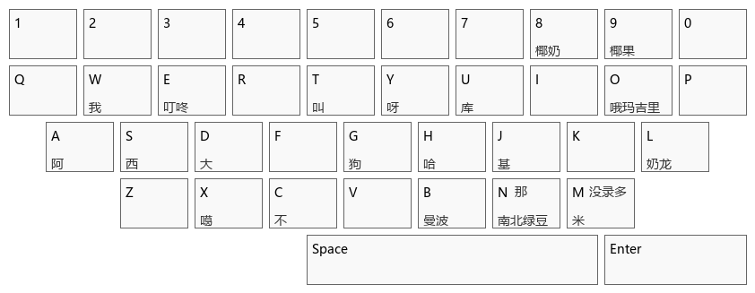

# hachimi-keyboard
专为哈基米歌词的数据标注任务设计的神人键盘，实现了将键盘上的特定键的功能改为向光标处输出自定义的特定短语，使用shift+CapsLK切换，并附带有一份词表可以让你快速输出哈基话，使用Python生成Autohotkey脚本来实现

安装Autohotkeyv1.x后，只需双击.ahk文件即可应用

词表的键位如下，在上方的词需要按Shift输入（如Shift+N可以输入“那”）

